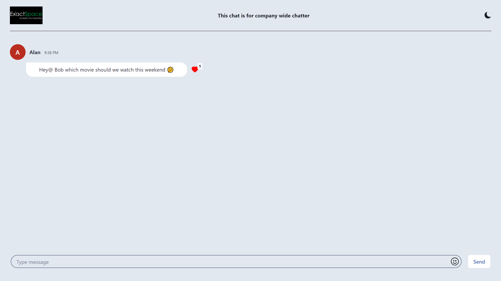
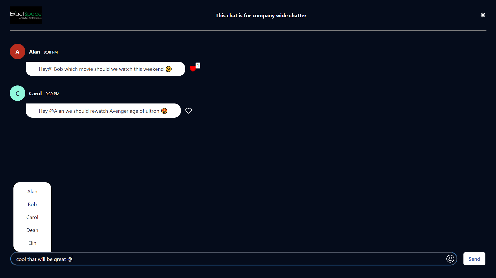
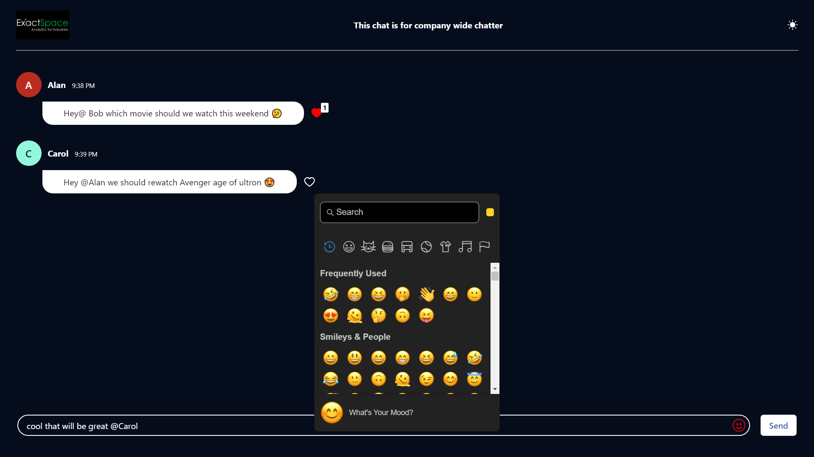
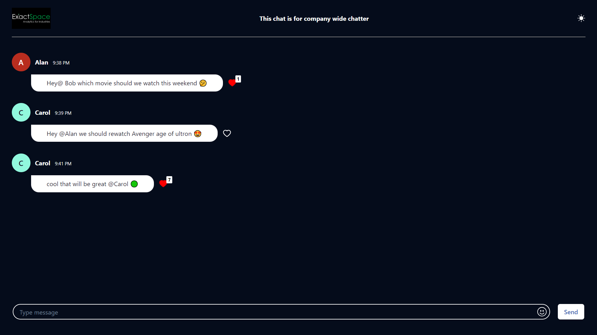

# Exactspace
Company Assignment of Exactspace on chatapp, 
Here you do chats with friends.

## Teach-Stack
| UI-Part |
|---------|
|   

## Deployments
|FRONTEND|
|--------|
||!

## For using this application locally follow the mentioned steps
1. Clone the repo
2. Do `npm install` 
3. For starting the application go to `chatapp` file
4. Run this command in the `chatapp` folder `npm run start` to run the application locally

### :small_blue_diamond: chat page
Clean UI

----

----
### :small_blue_diamond: Dark mode and mentioning on clicking "@"

----
### :small_blue_diamond: Emoji 

----

Thank you 💙
